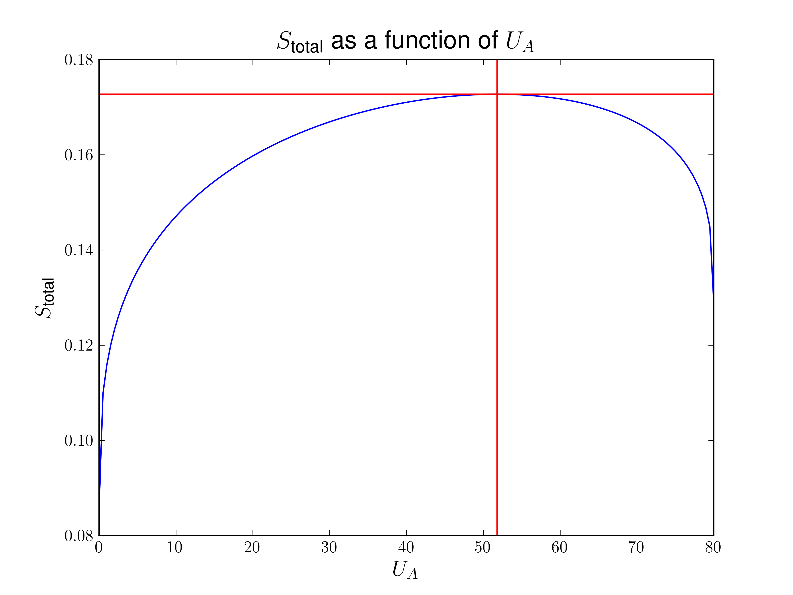

# Homework 2

[TOC]

## Problem 1

1. $S_A = \big( \frac{R^2}{v_0 \theta} \big) (N_A V_A U_A)^{\frac{1}{3}}$, and $S_B = \big( \frac{R^2}{v_0 \theta} \big) (N_B V_B U_B)^{\frac{1}{3}}$, so

  $$
  \begin{equation}
    \begin{split}
       \frac{S_{\text{total}}}{C} = \frac{S_A + S_B}{C}
       &=  (N_A V_A U_A)^\frac{1}{3} + (N_B V_B (80-U_A))^{\frac{1}{3}} \\
       &= (3 \times 9 \times 10^{-6} U_A)^\frac{1}{3} + (2 \times 4 \times 10^{-6} (80-U_A))^{\frac{1}{3}},
    \end{split}
  \end{equation}
  $$
  where $C = \big( \frac{R^2}{v_0 \theta} \big)$. The table is as follows.

2. $U_A$ is changing before equilibrium, $dU_A = \delta Q = -dU_B$. **For an isolated system**, when at equilibrium, the total entropy is at its maximum, that is

  $$
  \frac{1}{C}\frac{dS_{\text{total}}}{dU_A} = \frac{1}{3} \bigg[\bigg(\frac{N_A V_A}{U_A^2} \bigg)^{\frac{1}{3}}-\bigg( \frac{N_B V_B}{(80-U_A)^2} \bigg)^ {{\frac{1}{3}}}\bigg] = 0.
  $$
  Then $U_A = 51.8024\text{J}$. And $U_B = 28.1976\text{J}$.

3. From the figure we can see at $U_A = 51.8024\text{J}$, $S_{\text{total}}$ reaches its maximum $0.1727076\text{J/K}$.

## Problem 2

1. ​
  $$
   U(S, V, N) = \Big( \frac{v_0 \theta}{R^2} \Big) \frac{S^3}{NV},
  $$
   so
  $$
   \begin{align}
   T(S, V, N) &= \Big( \dfrac{\partial U}{\partial S} \Big)_{V, N} = \Big( \frac{v_0 \theta}{R^2} \Big) \frac{3S^2}{NV},\\
   p(S, V, N) &= -\Big( \dfrac{\partial U}{\partial V} \Big)_{S, N} = \Big( \frac{v_0 \theta}{R^2} \Big) \frac{S^3}{NV^2},\\
   \mu(S, V, N) &= \Big( \dfrac{\partial U}{\partial N} \Big)_{S, V} = -\Big( \frac{v_0 \theta}{R^2} \Big) \frac{S^3}{N^2 V}.
   \end{align}
  $$

2. Let $S' = \lambda S$, $V' = \lambda V$, $N' = \lambda N$, then

  $$
   \begin{align}
   T(S', V', N') &=  \Big( \frac{v_0 \theta}{R^2} \Big) \frac{3(S')^2}{N'V'} = \lambda^0\Big( \frac{v_0 \theta}{R^2} \Big) \frac{3S^2}{NV},\\
   p(S', V' N') &=\Big( \frac{v_0 \theta}{R^2} \Big) \frac{(S')^3}{N'(V')^2} = \lambda^0 \Big( \frac{v_0 \theta}{R^2} \Big) \frac{S^3}{NV^2},\\
   \mu(S', V', N') &=  -\Big( \frac{v_0 \theta}{R^2} \Big) \frac{(S')^3}{(N')^2 V'}= -\lambda^0\Big( \frac{v_0 \theta}{R^2} \Big) \frac{S^3}{N^2 V}.
   \end{align}
  $$
   So $T$, $p$, $\mu$ are homogeneous zero order functions, i.e., they are **intensive parameters**.

3. Let

  $$
  \Big( \frac{S^2}{NV} \Big)^{m} \Big( \frac{S^3}{NV^2} \Big)^{n} = \frac{S^3}{N^2 V},
  $$
  we derive $m = 3$, $n = -1$. Then by assuming $\mu = c T^3 p^{-1}$ we derive
  $$
  c = - \frac{1}{27 C} = - \frac{1}{27} \frac{R^2}{v_0\theta}.
  $$

## Problem 3

1. In one second, the water is

  $$
  \Delta m = \rho \Delta V,
  $$
  which is $n = \frac{\Delta m}{M_r} = \frac{10^6}{18}\text{mol}$, and the increase of internal energy is
  $$
  d U = g h \Delta m = 9.8 \times 270 \times 1000 \times 1 \text{J} = 2646000\text{J}.
  $$
  By Shomate equation
  $$
  C_p = A + Bt +C t^2 + D t^3 + \frac{E}{t^2} = 75.35107 \text{J}\cdot\text{mol}^{-1}\cdot\text{K}^{-1}
  $$
  So
  $$
  \Delta T= \frac{dU}{C_p n} = 0.63208 \text{K}.
  $$

2. Suppose on top the water is $300\text{K} = 27 ^\circ\text{C} = 80.6 ^\circ\text{F}$, so on bottom the water is $27.63208 ^\circ\text{C} = 81.7377 ^\circ\text{F}$, the difference is $1.1377^\circ\text{F}$. So it could be measurable with the highly sensitive thermometers which Joule developed.