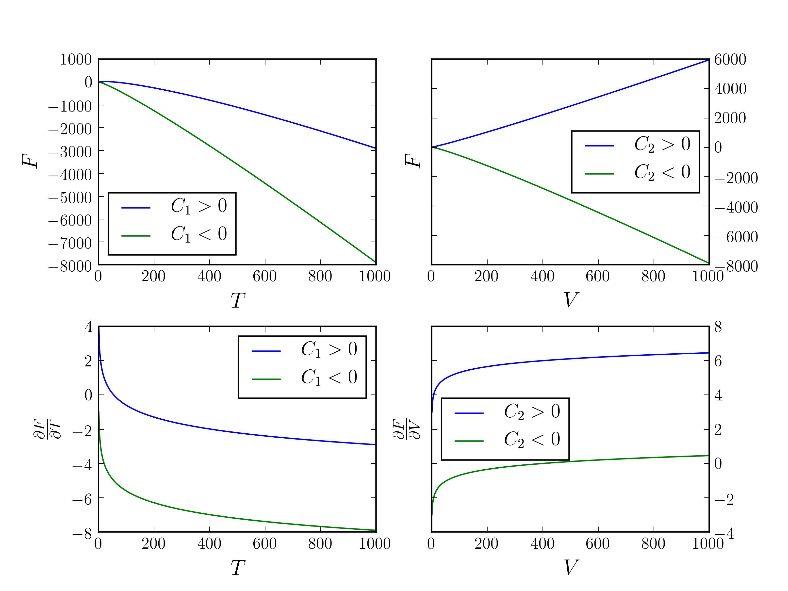

# Homework 4

[TOC]

## Problem 1

Known that
$$
G(T,p,N) = \frac{T^2 R N}{4\theta} - \frac{p^2 v_0 N}{4 R \theta},
$$
so
$$
\begin{align}
S &= - \Big( \dfrac{\partial G}{\partial T} \Big)_{p} = - \frac{T R N}{2 \theta},\\
V &= \Big( \dfrac{\partial G}{\partial p} \Big)_T = - \frac{p v_0 N}{2 R \theta}.
\end{align}
$$
That is,
$$
\begin{align}
T(S, V, N) &= - \frac{2S \theta}{R N},\\
p(S, V, N) &= - \frac{2R \theta V}{v_0 N}.
\end{align}
$$
Then
$$
\begin{equation}
    \begin{split}
        U(S, V, N) &= G - pV + TS\\
        	&= \frac{T^2 R N}{4\theta} - \frac{p^2 v_0 N}{4 R \theta} + \frac{2R \theta V^2}{v_0 N} - \frac{2 S^2 \theta}{R N}\\
        	&= - \frac{S^2 \theta}{R N} + \frac{R \theta V^2}{v_0 N}.
    \end{split}
\end{equation}
$$

## Problem 2

For any engine working between $2$ heat sources, the most efficient one is reversible engine, which could extract
$$
W=N c_V(T_1+T_2-2\sqrt{T_1 T_2})
$$
work from heat source $T_1$ and $T_2$, resulting in the equilibrium temperature of $2$ heat sources to be $\sqrt{T_1 T_2}$.
I first prove that no matter the reversible engine works between which $2$ heat sources initially, the final equilibrium temperature and total work are equal. So I wrote a toy Python code to justify this. Denote $A$ the heat source of $200\,\text{K}$, $B$ the heat source of $250\,\text{K}$, $C$ the heat source $540\,\text{K}$. See from the picture, the **final temperature** are all $300\,\text{K}$, and **total work** $450\,\text{cal}$. It's just a Fibonacci-like method:
$$
\text{equilibrium temperature } T(n) = \begin{cases}
T_3  , & n=1, \\
\big( T_1 T_2 \big)^{\frac{1}{2}}  , & n =2,\\
\sqrt{T(n-1) T(n-2)}, & n \geq 3.
\end{cases}
$$

Now suppose we do not have a computer, suppose the engine is reversible($\Delta S_{\text{engine}}=0$), in the whole process the entropy increase for whole system is greater than $0$ because it is isolated, i.e.,
$$
\begin{equation}
    \begin{split}
        \Delta S &= \Delta S_A + \Delta S_B + \Delta S_C + \Delta S_{\text{engine}} \\
        	&= \Delta S_A + \Delta S_B + \Delta S_C \\
        	&= N c_V\Big(   \int_{T_A}^{T_f} + \int_{T_B}^{T_f}  + \int_{T_C}^{T_f} \Big) \frac{dT}{T} \\
        	&= N c_V \ln \frac{T_f^3}{T_A T_B T_C} \geq 0.
    \end{split}
\end{equation}
$$
So $T_f \geq 300\,\text{K}$, and maximum work is thus
$$
W = N c_V (T_A - T_f - T_f + T_B - T_f + T_C) = 450 \,\text{cal}.
$$

## Problem 3

1. Stability criteria claims

  $$
  \begin{align}
  c_V &= T\Big( \frac{d S}{d T} \Big)_V \geq 0,\\
  \kappa_T &= - \frac{1}{V} \Big( \dfrac{\partial V}{\partial p} \Big)_T \geq 0.
  \end{align}
  $$

  And we have
  $$
  dG(T, p) = - S dT + V dp,
  $$

  so the constraints on the curvature are
  $$
  \begin{align}
  \Big( \dfrac{\partial^2 G}{\partial p^2} \Big)_T &= \Big( \dfrac{\partial V}{\partial p} \Big)_T = -V \kappa_T \leq 0,\\
  \Big( \frac{\partial^2 G}{\partial T^2} \Big)_{p} &= - \frac{c_p}{T} = - \frac{c_V}{T} - \frac{V\alpha^2}{\kappa_T} \leq 0,
  \end{align}
  $$
  for positive $V$ and $\alpha$.

2. We have

  $$
  dF(T, V) = - S dT - p dV,
  $$

  so constraints on the curvature are
  $$
  \begin{align}
  \Big( \frac{\partial^2 F}{\partial V^2} \Big)_{T} &= - \Big( \frac{\partial p}{\partial V} \Big)_{T} = \frac{1}{V \kappa_T} \geq 0,\\
  \Big( \dfrac{\partial^2 F}{\partial T^2} \Big)_V  &= - \Big( \dfrac{\partial S}{\partial T} \Big)_V = -\frac{ c_V }{T}\leq 0,
  \end{align}
  $$

  for positive $V$ and $\kappa_T$.

## Problem 4

$$
dF(T, V) = - S dT - p dV.
$$
Using Maxwell relations and definition of $\kappa_T$, we derive
$$
\begin{align}
\Big( \frac{\partial ^2 F}{\partial T^2} \Big)_V &= - \frac{1}{T} \Big( \dfrac{\partial Q}{\partial T} \Big)_V = - \frac{c_V}{T} \leq 0,\\
\Big( \dfrac{\partial^2 F}{\partial V^2} \Big)_T &= - \Big( \dfrac{\partial p}{\partial V} \Big)_T = \frac{1}{V \kappa_T} \geq 0.
\end{align}
$$

Thus
$$
\begin{align}
\dfrac{\partial F}{\partial T} &= - \int c_V \, d\ln T = - c_V \ln T + C_1,\\
\dfrac{\partial F}{\partial V} &= \int \frac{1}{\kappa_T} \, d\ln V = \frac{1}{\kappa_T} \ln V + C_2,
\end{align}
$$
where $C_1$ and $C_2$ are constants. Here we assume $\dfrac{\partial F}{\partial T}$ is not a function of $V$, and $\dfrac{\partial F}{\partial V}$ is not a function of $T$, to simplify the possibilities.

Then
$$
\begin{align}
F &= \int (C_1 - c_V \ln T')  \, dT' = (C_1 + c_V) T - c_V T \ln T + g(V),\\
F &= \int ( \frac{1}{\kappa_T} \ln V' + C_2) \, dV' = \Big( C_2 - \frac{1}{\kappa_T} \Big) V + \frac{1}{\kappa_T} V \ln V + f(T),
\end{align}
$$
now we finally know
$$
\begin{equation}
    \begin{split}
        F &= (C_1 + c_V) T - c_V T \ln T + \Big( C_2 - \frac{1}{\kappa_T} \Big) V + \frac{1}{\kappa_T} V \ln V  + C_3\\
        	&\overset{{\text{redef}}}{=}C_1 T - c_V T \ln T + C_2 V + \frac{1}{\kappa_T} V \ln V  + C_3,
    \end{split}
\end{equation}
$$
where $C_3$ is a constant.

**Comment:**

Actually we should expect $F$ has negative slope and negative curvature wrt $T$, and positive slope and positive curvature wrt $V$, so constants $C_1$ and $C_2$ shouldn't affect so much,

## Problem 5

$$
\begin{equation}
    \begin{split}
       \Big(  \frac{dH}{dV}  \Big)_{T, N} &= T \Big( \frac{dS}{dV} \Big)_{T, N} + V\Big( \frac{dp}{dV} \Big)_{T, N}\\
        	&= T \Big( \frac{dp}{dT} \Big)_{V, N} + V\Big( \frac{dp}{dV} \Big)_{T, N}\\
        	&= -T \frac{\big( \frac{\partial V}{\partial T} \big)_{p, N}}{\big( \frac{\partial V}{\partial p} \big)_{T, N}} + V\Big( \frac{dp}{dV} \Big)_{T, N}\\
        	&= - \frac{T \frac{1}{V}\big( \frac{\partial V}{\partial T} \big)_{p, N}}{\frac{1}{V}\big( \frac{\partial V}{\partial p} \big)_{T, N}} - \frac{ 1 }{ \kappa_T }\\
        	&= \frac{T\alpha -1}{\kappa_T}.
    \end{split}
\end{equation}
$$

## Problem 6

Berthelot equation is
$$
\Big( p+\frac{N^2 a}{TV^2} \Big)(V -N b)= NRT,
$$
so
$$
p = \frac{N RT}{V -Nb}- \frac{N^2 a}{TV^2},
$$
make first and second derivatives of pressure with respect to volume at constant temperature and mole numbers,
$$
\begin{align}
\Big( \dfrac{\partial p}{\partial V} \Big)_{T, N}\bigg|_{p_0, V_0, T_0} &= - \frac{N RT_0}{(V_0- N b)^2} + \frac{2N^2 a}{T_0 V_0^3}=0,\\
\Big( \dfrac{\partial^2 p}{\partial V^2} \Big)_{T, N}\bigg|_{p_0, V_0, T_0} &= \frac{2N RT_0}{(V_0- N b)^3} - \frac{6 N^2 a}{T_0 V_0^4} = 0,\\
\end{align}
$$
so
$$
\begin{cases}
V_0 = 3 N b,\\
T_0 = \displaystyle\frac{2}{3} \sqrt{\frac{2a}{3b R}},\\
p_0 = \displaystyle\frac{1}{6\sqrt{6}b} \sqrt{\frac{aR}{b}}.
\end{cases}
$$

## Problem 7

1. We know

  $$
  dH = T \, dS + V \, dp,
  $$

  where
  $$
  \begin{equation}
      \begin{split}
          dS &= \Big( \frac{\partial S}{\partial p} \Big)_{T} \, dp + \Big( \frac{\partial S}{\partial T} \Big)_{p}\, dT\\
          	&= - \alpha V\, dp + \frac{c_p}{T}\, dT,
      \end{split}
  \end{equation}
  $$
  and since $dV = \alpha V T - \kappa_T V dp \approx -\kappa_T V dp$,
  $$
  \begin{equation}
      \begin{split}
          V &= V^{\ce{Fe}} e^{- \kappa_T (p-1)}\\
          	& \stackrel{\smash{\scriptscriptstyle\text{1st order}}}{\approx} V^{\ce{Fe}} (1 - \kappa_T p),
      \end{split}
  \end{equation}
  $$

  since $\exp(\kappa_T p_0) \approx 1$ where $p_0 = 1\,{\text{atm}}$.

  Thus
  $$
  \begin{equation}
      \begin{split}
          dH &= \Big( -\alpha V \, dp + \frac{c_p}{T} \, dT \Big)T + V \, dp\\
          	&= c_p \, dT + V^{\ce{Fe}}(1- \kappa_T p)(1- \alpha T) dp.
      \end{split}
      \label{eq:dH}
  \end{equation}
  $$
  Integrate $\eqref{eq:dH}$ we derive
  $$
  \begin{equation}
      \begin{split}
          \Delta H &= \int_{T_0}^{T_1} c_p \, dT + \int_{p_0}^{p_1} V^{\ce{Fe}}(1- \kappa_T p)(1- \alpha T) dp\\
          		&= 4.600\times 10^3 \,\text{cal}\cdot \text{mol}^{-1}.
      \end{split}
  \end{equation}
  $$

  Then
  $$
  \begin{equation}
      \begin{split}
          \Delta S &= \int_{T_0}^{T_1} \frac{c_p}{T} \, dT - \int_{p_0}^{p_1}  \alpha V^{\ce{Fe}}(1- \kappa_T p)\, dp\\
          		&= 2.014 \,\text{cal}\cdot\text{mol}^{-1}\cdot\text{K}^{-1}.
      \end{split}
  \end{equation}
  $$

2. ​

  $$
  \begin{equation}
      \begin{split}
          c_V &= c_p - \frac{\alpha^2 V T}{\kappa_T}\\
          	&= 7.477\,\text{cal}\cdot\text{mol}^{-1}\cdot\text{K}^{-1}.
      \end{split}
  \end{equation}
  $$

