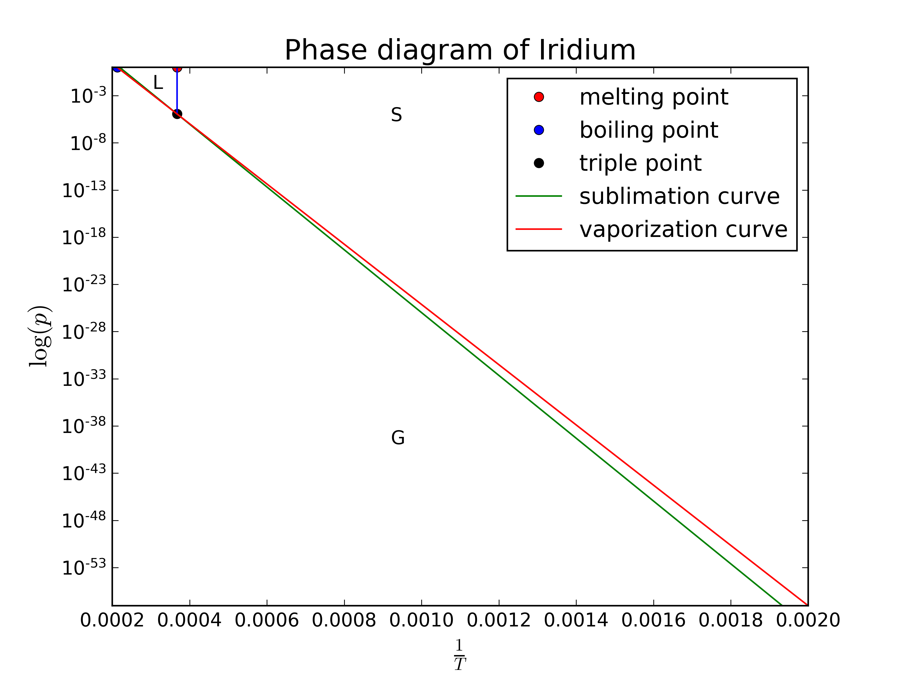
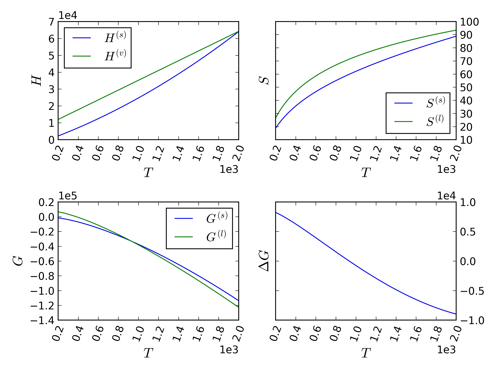

# Homework 5

[TOC]

## Problem 1

Given that
$$
\Big( \frac{d p}{d T} \Big)_{V} \bigg|_{T_b} = \frac{\lambda}{T_b v},
$$
with $v = \frac{ RT }{ p } = 0.2732 \,{\text{m}}^3$ when $p = 1 \,{\text{atm}}$,
$$
\lambda = T_b v \Big( \frac{d p}{d T} \Big)_{V} \bigg|_{T_b} \approx 342.958\,\text{kJ}.
$$

## Problem 2

We know that $\Delta H_{s} = \Delta H_m + \Delta H_{v} = 637.1\times 10^3 \,{\text{J}}$, and
$$
1= A_{v} \exp \Big(-\frac{611\times  10^3}{8.314\times 4700 } \Big),  \label{eq:av}
$$
so $A_{v} = 6.1766 \times 10^6\,\text{atm}$.
The triple point is $T_t = T_m = 2720\,{\text{K}}$, substitue into $\eqref{eq:av}$,
$$
\begin{equation}
    \begin{split}
        p_t &= 1.1396 \times 10^{-5} \,{\text{atm}}\\
        	&= A_s \exp\Big( - \frac{ 637.1\times 10^3 }{ 8.314 \times 2720 } \Big),
    \end{split}
\end{equation}
$$
so $A_{s} = 1.9502 \times 10^7\,{\text{atm}}$, thus

$$
\begin{align}
  p_{s}(T) &= 1.9502 \times 10^7 \exp\Big(-\frac{637.1\times 10^3}{8.314 T} \Big) \,{\text{atm}},\\
  p_{v} (T) &= 6.1766 \times 10^6 \exp \Big(-\frac{611\times 10^3}{8.314 T} \Big) \,{\text{atm}}.
\end{align}
$$

At $300\,\text{K}$,
$$
\begin{align}
  p_{s}(300) & = 2.2756 \times 10^{-104} \,\text{atm},\\
  p_{v} (300) &= 2.5256\times 10^{-100} \,\text{atm}.
\end{align}
$$
The phase diagram is below.

## Problem 3

1. Let $p^{(l)}(T)=1\,\text{atm}$, then

  $$
  0 = - \frac{31090}{T_b} - 2.52 \ln T_b + 34.66,
  $$

  so $T_b = 2006.05\,\text{K}$.

2. At triple point, $p^{(l)} = p^{(s)}$, so

  $$
  -\frac{34450}{T_t} - 2.01 \ln T_t + 33.74 =  - \frac{31090}{T_t} - 2.52 \ln T_t + 34.66,
  $$

  then $T_t = 1238.85\,\text{K}$, $p_t = 0.00022869\,\text{atm}=23.172\,\text{Pa}$.

3. ​

  $$
  \lambda = \frac{ RT_b^2 }{ p } \Big( \frac{ dp }{ dT } \Big)\bigg|_{T=T_b} = R T_b^2 \Big( \frac{ d\ln p }{ dT } \Big)\bigg|_{T=T_b} = 216452.9\,{\text{J}}.
  $$

4. At triple point,

  $$
  \begin{align}
    \lambda_{\text{boil}} &= \frac{ RT_t^2 }{ p } \Big( \frac{ dp }{ dT } \Big)\bigg|_{T=T_t} = R T_t^2 \Big( \frac{ d\ln p }{ dT } \Big)\bigg|_{T=T_t} = 232527 \,{\text{J}}, \\
   \lambda_{\text{sub}} &= \frac{ RT_t^2 }{ p } \Big( \frac{ dp }{ dT } \Big)\bigg|_{T=T_t} = R T_t^2 \Big( \frac{ d\ln p }{ dT } \Big)\bigg|_{T=T_t} = 265715 \,{\text{J}},
  \end{align}
  $$

  so $\lambda_{\text{melt}} = \lambda_{\text{sub}}- \lambda_{\text{boil}} = 33188\,{\text{J}}$.

5. We know

   $$
   \lambda = R T^2 \frac{ d \ln p }{ dT } = R T^2 \frac{ d }{ dT }\bigg( -\frac{ A }{ T } - B \ln T + C\bigg) = R(A - BT),
   $$
   thus
   $$
   \begin{align}
     \lambda_{\text{boil}} &= R (31090 - 2.52 T)\\
     \lambda_{\text{sub}}&= R(34450 - 2.01 T)
   \end{align}
   $$
   therefore $\lambda_{\text{melt}} = R(3360 + 0.51 T)$. Thus at triple point,
   $$
   c_p = \Big( \frac{ d }{ dT } \Big)_p \lambda_{\text{melt}} = 0.51 R = 4.240 \,{\text{J}}\cdot{\text{K}}^{-1}\cdot{\text{mol}}^{-1}.
   $$

## Problem 4

1. At $298\,\text{K}$,

  $$
  c_p^{(s)} = 20.7 + 12.4\times  10^{-3} \times 298 = 24.3952\,\text{J}\cdot \text{mol}^{-1}\cdot\text{K}^{-1},
  $$

  this is same to $24.4\,\text{J}\cdot \text{mol}^{-1}\cdot\text{K}^{-1}$ on the [site](https://www.webelements.com/aluminium/thermochemistry.html).

2. Enthalpy of fusion $\Delta H_{m} = 10.7\times 10^3 \,\text{J}\cdot\text{mol}^{-1}$, melting point $T_{m} = 933.47\,\text{K}$, and fusion occurs when $\Delta G$ is going to turn negative, i.e.,

  $$
  \Delta G = \Delta H_{m} - T_{m} \Delta S_{m} = 0,
  $$

  thus $\Delta S_{m} = 11.462\,\text{J}\cdot \text{K}^{-1}\cdot \text{mol}^{-1}$.

3. $H^{(s)}_{298} = 4.540\times 10^3\,\text{J}\text{mol}^{-1}$, $c_p^{(l)} = 29.0\,\text{J}\cdot \text{mol}^{-1}\cdot\text{K}^{-1}$, so

  $$
  \begin{align}
    H^{(s)}(T) &= H^{s}_{298} + \int_{298}^{T} c_p^{(s)} \, dT' = (20.7 T + 0.0062 T^2 - 2179.2) \,\text{J}\cdot \text{mol}^{-1},\\
    H^{(v)}(T) &= H^{s}_{T_m} + \Delta H_{m} + \int_{T_{m}} ^T c_p^{(l)} \, dT' = (29T + 6175.6)\,\text{J}\cdot \text{mol}^{-1}.
  \end{align}
  $$

4. $S_{298}^{(s)} = 28.30 \,\text{J}\cdot \text{K}^{-1}\cdot \text{mol}^{-1}$, so

  $$
  \begin{align}
    S^{(s)}(T) &= S^{(s)}_{298} + \int_{298}^T \frac{c_p^{(s)}}{T'} \, dT' = \big( 20.7 \ln T + 0.0124 T - 93.325 \big)\,\text{J}\cdot \text{K}^{-1}\cdot \text{mol}^{-1},\\
    S^{(l)}(T) &= S^{(s)}_{T_m} + \Delta S_m + \int_{T_m}^T \frac{c_p^{(l)}}{T'} \, dT' = \big( 29 \ln T - 127 \big) \,\text{J}\cdot \text{K}^{-1}\cdot \text{mol}^{-1}.
  \end{align}
  $$

5. With above,

  $$
  \begin{align}
    G^{(s)}(T) &= H^{(s)}- T S^{(s)} = \big( -20.7 T \ln T + 114 T - 0.0062 T^2 - 2179.2 \big)\,\text{J}\cdot \text{mol}^{-1},\\
    G^{(l)}(T) &= H^{(l)} - T S^{(l)} = \big( -29 T \ln T + 156 T + 6175.6 \big) \,\text{J}\cdot \text{mol}^{-1}.
  \end{align}
  $$

6. We have

  $$
  \Delta G = G^{(s)} - G^{(l)} = \big( -8.3T \ln T + 42.02 T + 0.0062 T^2 + 8354.7 \big) \,\text{J}\cdot \text{mol}^{-1}.
  $$

7. At $T= 933.041\,{\text{K}}$, they across. Yes, this is at the expected temperature.

## Problem 5

Triple point is an equilibrium state, so it satisfies
$$
\begin{align}
  \Delta S_{{\text{sys}}} &= \sum_{j} \Delta S_j = 0,\\
  \Delta V_{\text{sys}} &= \sum_j \Delta V_j = 0.
\end{align}
$$
Since $\Delta H = T \Delta S + V \Delta p$, and at equilibrium, $T_1 = T_2 = \ldots$ and $p_1 = p_2 = \ldots = p$, so $\Delta p = \sum_j \Delta p_j = 0$, thus $\Delta H = \sum_j \Delta H_j = T \sum_j \Delta S_j + V \times 0 = 0$.
