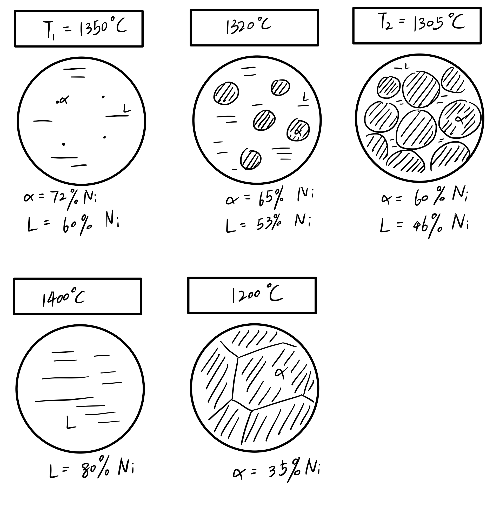
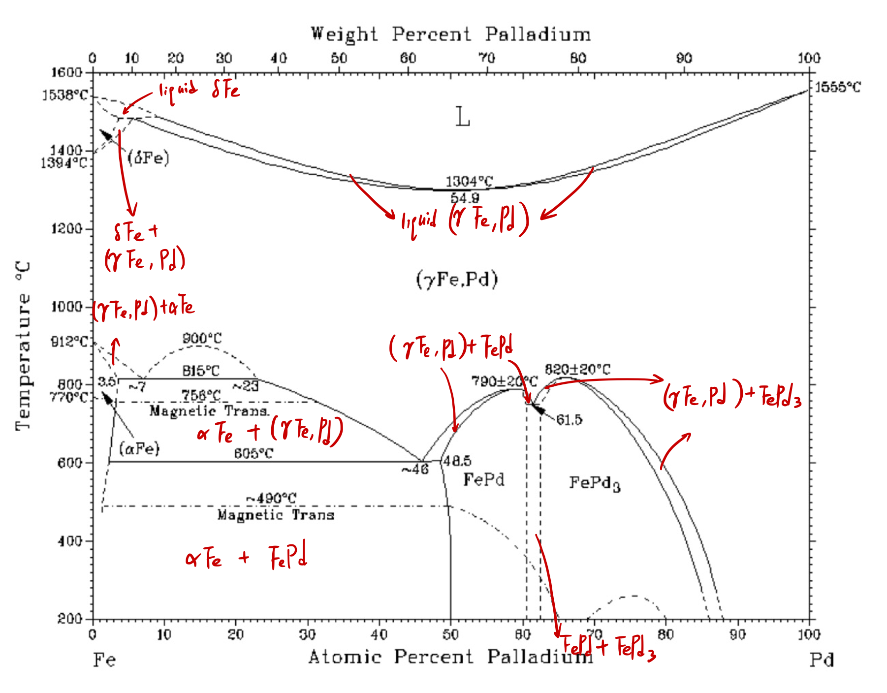
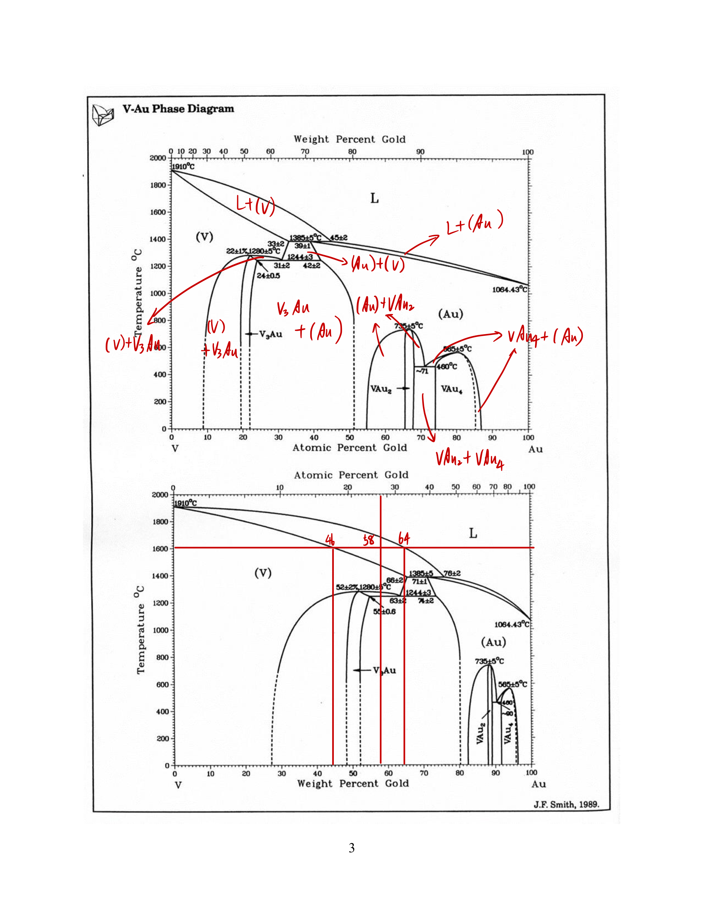

# Homework 6

[TOC]

## Problem 1

1. Around $T_1 = 1350^\circ \mathrm{ C }$, at the crossing point of liquidus line and $60\,{\text{wt}}\%$ $\ce{Ni}$ line (red solid line). Based on lever rule, the $\alpha$ phase fraction is almost $0\%$, liquid phase fraction is almost $100\%$.

2. At $T_1 = 1350^\circ \mathrm{ C }$, find the horizontal coordinate of solidus line, so $\alpha$ phase composition is nearly $72 \,{\text{wt}}\%$ $\ce{Ni}$ (blue line).

3. Almost at $T_2 = 1305^\circ \mathrm{ C }$ (green line), at the crossing point of solidus line and $60\%$ $\ce{Ni}$ line. Based on lever rule, the $\alpha$ phase fraction is almost $100\%$, liquid phase fraction is almost $0\%$.

4. At $T_2 = 1305^\circ \mathrm{ C }$, find the horizontal coordinate of liquidus line, it is $46\,{\text{wt}}\%$ $\ce{Ni}$ (brown line).

5. At $T_3=1320^\circ \mathrm{ C }$ (red dashed line), find the horizontal coordinate of liquidus line and solidus line, it will be $53\,{\text{wt}}\%$ $\ce{Ni}$ in liquid phase, as well as $65\,{\text{wt}}\%$ $\ce{Ni}$ in $\alpha$ phase.

6. Based on lever rule,
  $$
  \begin{align}
    w_L &= \frac{ 65 - 60 }{ 65 - 53 } = 41.7 \%,\\
    w_\alpha &= \frac{ 60 - 53 }{ 65-53 } = 58.3 \%.
  \end{align}
  $$

7. See figure below.

   

**Summary:**

At $1400^\circ \mathrm{ C }$, there is only liquid phase, when temperature goes down, the composition of liquid phase goes as liquidus line. When it hits $T = 1350^\circ \mathrm{ C }$, $\alpha$ phase starts to grow, at this time liquid phase contains $60\%$ $\ce{Ni}$. When it hits $T = 1305^\circ \mathrm{ C }$, liquid phase is no longer exist, the composition of $\alpha$ phase is $60\%$ $\ce{Ni}$, same as where it originates. This is because the start point and end point of solidification is on the same vertical line (red solid line). After that, $\alpha$ phase goes as solidus line.

## Problem 2

1. ​
   $$
   \begin{cases}
    L, \alpha\ce{Fe}, \delta\ce{Fe},   (\gamma\ce{Fe}, Pd), \ce{FePd}, \ce{FePd3} & {\text{single phase}} \\
       \begin{aligned}
           & L+\delta \ce{Fe}, \delta \ce{Fe} + (\gamma\ce{Fe}, \ce{Pd}), \alpha\ce{Fe}+(\gamma\ce{Fe},\ce{Pd})\\
    	&\alpha\ce{Fe} +\ce{FePd}, (\gamma\ce{Fe},\ce{Pd})+\ce{FePd},(\gamma\ce{Fe},\ce{Pd})+\ce{FePd3},\\
   	 &\ce{FePd}+\ce{FePd3}, L+(\gamma{Fe}, \ce{Pd})
       \end{aligned} & {\text{two phases}}
   \end{cases}
   $$

2. See figure below.

   

3. See below.

   1. allotropic:
      $$
      \begin{equation}
          \begin{split}
              \ce{\alpha  Fe} &\ce{ ->[912^\circ \mathrm{ C }] }& \ce{\gamma Fe}\\
              0\% & & 0\%
          \end{split}
      \end{equation}
      $$

   2. allotropic:
      $$
      \begin{equation}
          \begin{split}
              \ce{\gamma Fe} & \ce{->[1394^\circ \mathrm{ C }]} & \ce{\delta Fe}\\
              0\% & & 0\%
          \end{split}
      \end{equation}
      $$

   3. melting:
      $$
      \begin{equation}
          \begin{split}
              \ce{\delta Fe} & \ce{->[1538^\circ \mathrm{ C }]} & \ce{Fe (l)}\\
              0\% & & 0\%
          \end{split}
      \end{equation}
      $$

   4. eutectoid:
      $$
      \begin{equation}
          \begin{split}
            &  \alpha \ce{Fe} + &\ce{FePd} & \ce{->[605^\circ \mathrm{ C }]} & (\ce{\gamma Fe, Pd})\\
             & 2.7 \% & 48.5\%  & & 46\%
          \end{split}
      \end{equation}
      $$

   5. peritectic:
      $$
      \begin{equation}
          \begin{split}
            (\ce{\gamma Fe, Pd}) & \ce{->[1480^\circ \mathrm{ C }]} &\ce{\delta Fe} &+ & L\\
             5.8\% & & 3.5\%  & & 10\%
          \end{split}
      \end{equation}
      $$

   6. congruent melting:
      $$
      \begin{equation}
          \begin{split}
              (\ce{\gamma Fe, Pd}) & \ce{->[1304^\circ \mathrm{ C }]} & L\\
              54.9\% & & 54.9\%
          \end{split}
      \end{equation}
      $$

   7. congruent melting:
      $$
      \begin{equation}
          \begin{split}
              \ce{FePd} & \ce{->[790^\circ \mathrm{ C }]} & (\ce{\gamma Fe, Pd})\\
              59\% & & 59\%
          \end{split}
      \end{equation}
      $$

   8. eutectoid:
      $$
      \begin{equation}
          \begin{split}
            &  \ce{FePd} + & \ce{FePd3} & \ce{->[760^\circ \mathrm{ C }]} & (\ce{\gamma Fe, Pd})\\
             & 60.5\% & 62.5\% & & 61.5\%
          \end{split}
      \end{equation}
      $$

   9. congruent melting:
      $$
      \begin{equation}
          \begin{split}
              \ce{FePd3} & \ce{->[820^\circ \mathrm{ C }]} & (\ce{\gamma Fe, Pd})\\
              67\% & & 67\%
          \end{split}
      \end{equation}
      $$

   10. melting:
    $$
    \begin{equation}
     \begin{split}
     \ce{Pd(s)} & \ce{->[1555^\circ \mathrm{ C }]} & \ce{Pd(l)}\\
     100\% & & 100\%
     \end{split}
     \end{equation}
    $$

   11. monotectoid:
       $$
       \begin{equation}
           \begin{split}
             &  \alpha \ce{Fe} + &\ce{(\gamma Fe, Pd)}^{\mathrm{ II }} & \ce{->[815^\circ \mathrm{ C }]} & (\ce{\gamma Fe, Pd})^{\mathrm{ I }}\\
              & 3.5 \% & 23\%  & & 7\%
           \end{split}
       \end{equation}
       $$

## Problem 3

1. See figure below.

   

2. See below.

   1. melting:
      $$
      \ce{V(s)}  \ce{->[1910^\circ \mathrm{ C }]}  \ce{V(l)}
      $$

   2. congruent melting:
      $$
      \ce{V3Au ->[1280^\circ \mathrm{ C }] (V)}
      $$

   3. eutectoid:
      $$
      \ce{V3 Au + (Au) ->[1244^\circ \mathrm{ C }] (V)} \label{eq:reaction}
      $$

   4. peritectic:
      $$
      \ce{(Au) ->[1385^\circ \mathrm{ C }] L + (V)}
      $$

   5. congruent melting:
      $$
      \ce{VAu2 ->[735^\circ \mathrm{ C }] (Au)}
      $$

   6. eutectoid:
      $$
      \ce{VAu2 + VAu4 ->[460^\circ \mathrm{ C }] (Au)}
      $$

   7. congruent melting:
      $$
      \ce{VAu4 ->[585^\circ \mathrm{ C }] (Au)}
      $$

   8. melting:
      $$
      \ce{Au(s) ->[1064.43^\circ \mathrm{ C }] Au(l)}
      $$

3. In liquid phase, there's $64\,{\text{wt}}\%$ $\ce{Au}$, while in solid there's $46\,{\text{wt}}\%$, so
  $$
  w_L = \frac{ 58 - 46 }{ 64-46  } = 66.67\%.
  $$

4. The reaction is $\eqref{eq:reaction}$. Weight fraction of $\ce{(Au)}$ phase is
  $$
  w_{\ce{(Au)}} = \frac{ 58-55 }{ 63-55 } = 37.5\%.
  $$

